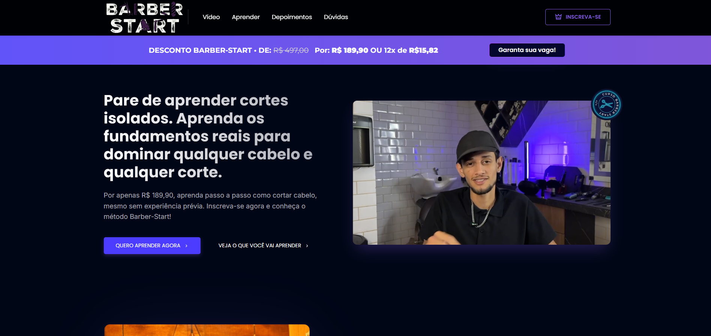

<h1 align="center"> Barber Start - Landing Page ✂️💈 </h1>

<div align="center">
  
</div>

<p align="center">
  Uma Landing Page moderna e responsiva desenvolvida para barbearias, focada em apresentação de serviços e agendamento rápido via WhatsApp.
</p>


<br>

<p align="center">
  
</p>

## 🚀 Tecnologias

Esse projeto foi desenvolvido utilizando as bases da web moderna:

- **HTML5** (Estrutura semântica e acessível)
- **CSS3**
  - **Flexbox & Grid** (Para alinhamento perfeito dos elementos)
  - **Media Queries** (Totalmente responsivo para Mobile e Desktop)
  - **Animações e Transições** (Hover effects nos botões e cards)
- **JavaScript** (Interatividade do menu mobile e botões de ação)

## ✨ Funcionalidades

- **Agendamento Direto:** Botões "Call to Action" (CTA) integrados com link de WhatsApp.
- **Menu Mobile:** Navegação fluida em dispositivos móveis.
- **Seção de Serviços:** Exibição clara de cortes e preços.
- **Localização:** Integração visual para facilitar a chegada do cliente.
- **Animações:** Elementos rotativos (`barber-start-rotate`) e efeitos visuais que prendem a atenção.

## 🎨 Design

O layout segue a tendência **"Barber Dark"**, transmitindo elegância e profissionalismo.

- **Cores Principais:** - Fundo: `#1e1e1e` (Preto Fosco)
  - Detalhes: `#d4af37` (Dourado/Gold)
  - Texto: `#ffffff` (Branco para contraste)
- **Tipografia:** Fontes modernas e robustas para facilitar a leitura.

## 📂 Estrutura de Pastas

```bash
projeto-landing-page-jonas/
├── assets/             # Imagens, Logos e Ícones
├── index.html          # Estrutura principal
├── styles.css          # Estilização completa
├── script.js           # Lógica do Menu e Interações
└── README.md           # Documentação
```
Feito com estilo por João Pedro 👋 Entre em contato!
